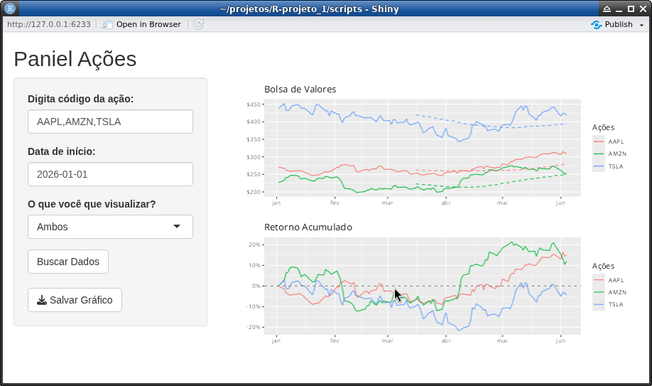

# Análise de Performance e Volatilidade: Big Techs (2026)

Este projeto utiliza a linguagem **R** para coletar, tratar e visualizar a performance acumulada das ações, para exemplo usei Apple (AAPL), Amazon (AMZN) e Tesla (TSLA). O objetivo é demonstrar a diferença entre o preço nominal das ações e o seu real retorno ao investidor, além de aplicar indicadores de tendência (Médias Móveis).

## 🚀 Tecnologias Utilizadas
* **R** (v4.x)
* `tidyquant` para coleta de dados do Yahoo Finance.
* `tidyverse` (ggplot2, dplyr) para manipulação e gráficos.
* `patchwork` e `scales` para customização visual e alinhamento dos painéis.
* `shiny` para um painel interativo dinâmico.

## 🖥️ Interface Interativa (Shiny Web App)
O  painel interativo permite ao usuário final:
* **Customização de Ativos:** Digitar qualquer ticker de ação (ex: AAPL, TSLA) para carregar os dados em tempo real.
* **Filtro Temporal:** Escolher a data de início da análise através de um calendário dinâmico.
* **Alternância de Gráficos:** Alternar visualizações entre Preço Nominal, Retorno Acumulado ou ambos simultaneamente de forma responsiva.
* **Exportação de Relatório:** Botão para download automático do gráfico gerado em alta resolução (.png).

## 📊 Insights e Análise de Mercado

### 1. Apple (AAPL) e Amazon (AMZN): Consistência de Longo Prazo
* **Comportamento:** Ambas as empresas demonstraram excelente resiliência ao longo do ano. Começaram a descolar positivamente a partir de abril.
* **Resultado:** Encerraram o período analisado com retornos acumulados expressivos (Amazon próxima de +20% e Apple de +15%). São ativos que mostram menor volatilidade diária, ideais para estratégias de **Longo Prazo (Buy & Hold)**.

### 2. O "Caso Tesla (TSLA)": O Desafio da Volatilidade
* **O Problema do Preço Nominal:** Olhando apenas para o gráfico de preço em dólar, a TSLA parece dominante devido ao seu valor nominal elevado (acima de $400).
* **A Realidade do Retorno:** O gráfico de Retorno Acumulado revela uma volatilidade extrema. A ação chegou a amargar quase **-25% de queda** no início de abril. 
* **Conclusão de Risco:** Embora a TSLA tenha se recuperado fortemente em maio (voltando para o terreno do zero a zero), esse comportamento de "montanha-russa" mostra que ela exige estômago. Para investidores focados estritamente em longo prazo e conservadores, a alta volatilidade da TSLA representa um risco maior de *drawdown* (perda máxima temporária) se comparada à consistência de AMZN e AAPL.

## 🛠️ Como Executar o Script
1. Clone o repositório.
2. Abra o arquivo `scripts/analise_retornos.R` no RStudio.
3. Instale as dependências necessárias e execute o código.
